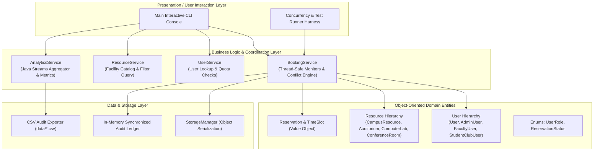
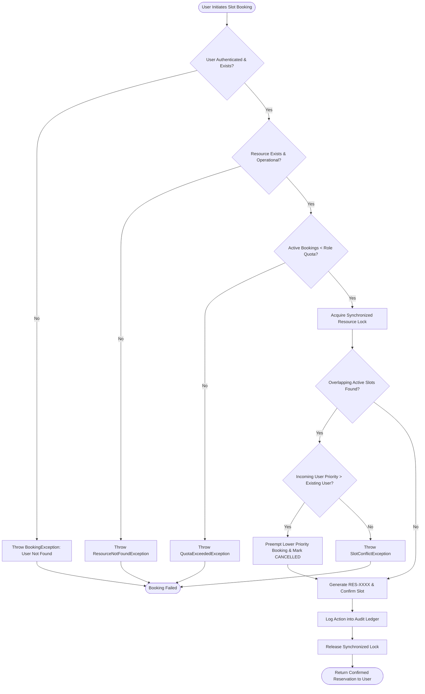
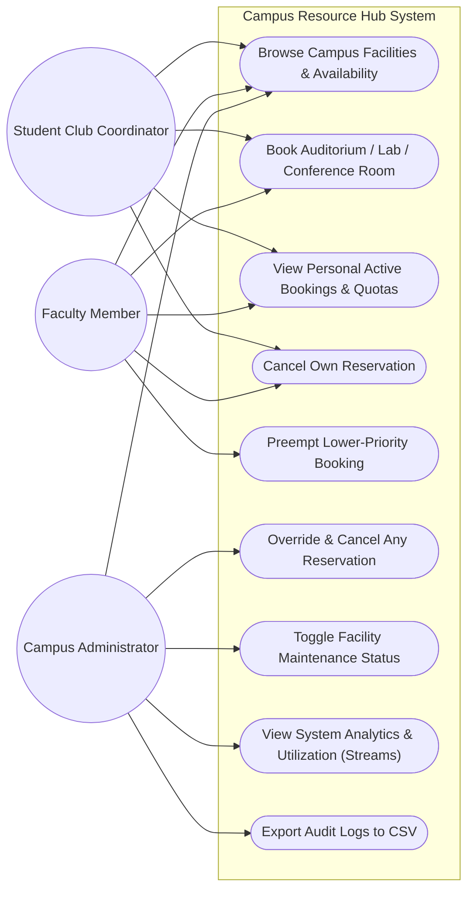
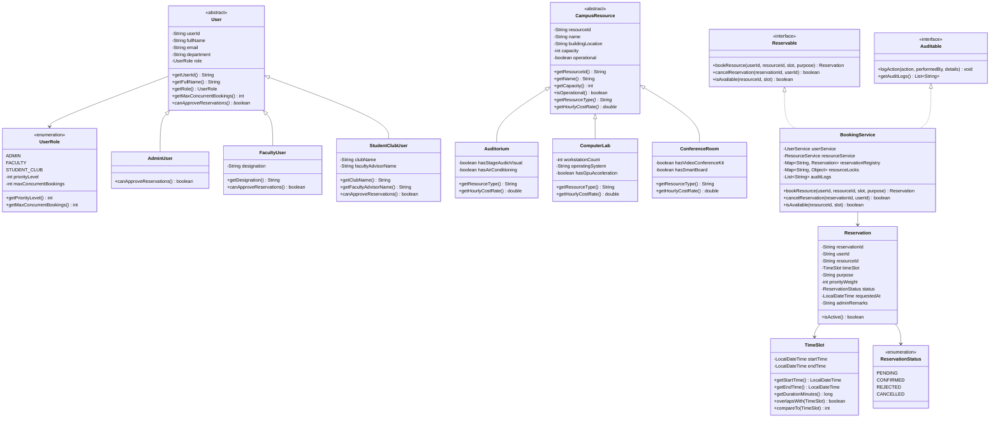
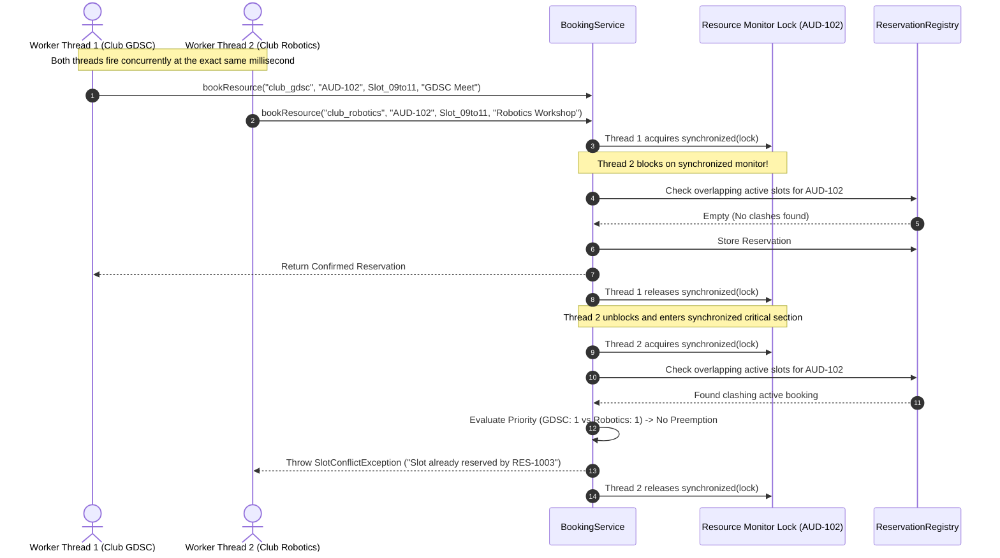
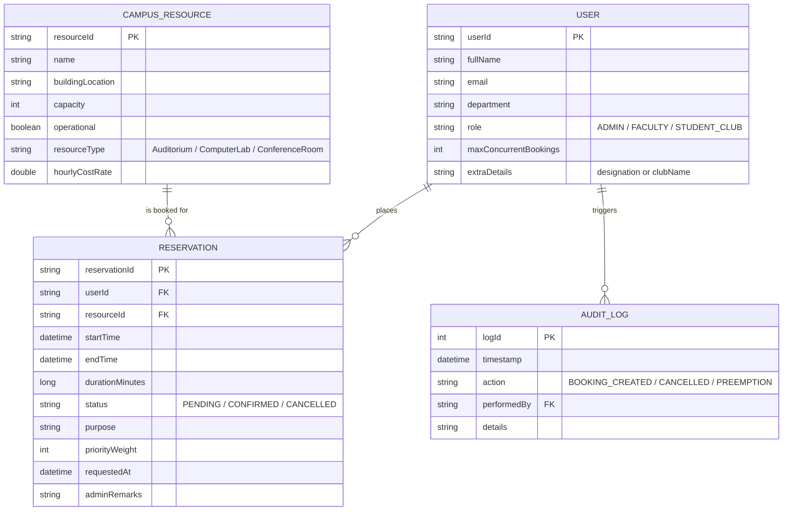

# Design Diagrams: Campus Facility & Event Resource Booking System (CampusResourceHub)

This document contains all required architectural and UML diagrams specified in Section 4 of the VITyarthi Project Guidelines. The diagrams are rendered in standard GitHub Markdown Mermaid format.

---

## 1. System Architecture Diagram (Layered Architecture)

---

## 2. Process Flow / Workflow Diagram (Reservation Lifecycle)

---

## 3. UML Use Case Diagram

---

## 4. UML Class Diagram (Core OOP Model)

---

## 5. UML Sequence Diagram (Multi-Threaded Concurrent Booking Resolution)

---

## 6. Entity Relationship (ER) / Storage Schema Diagram

